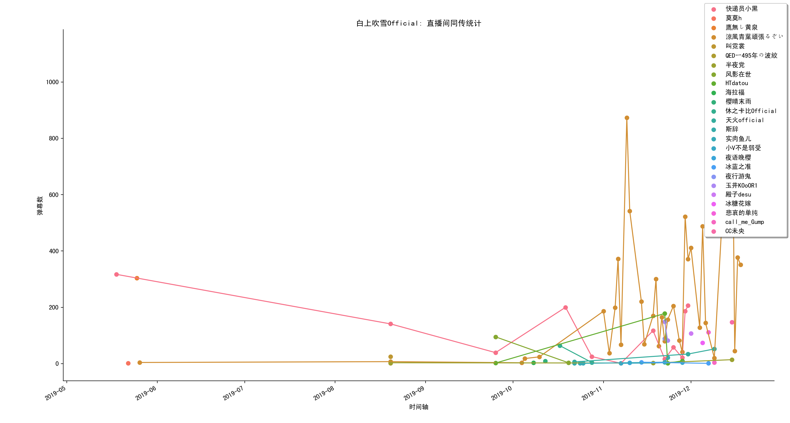
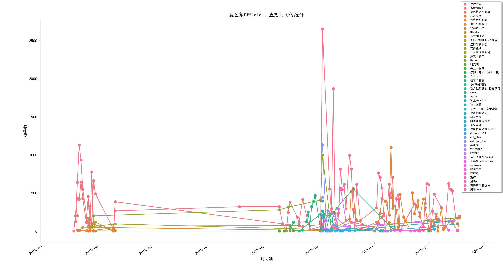
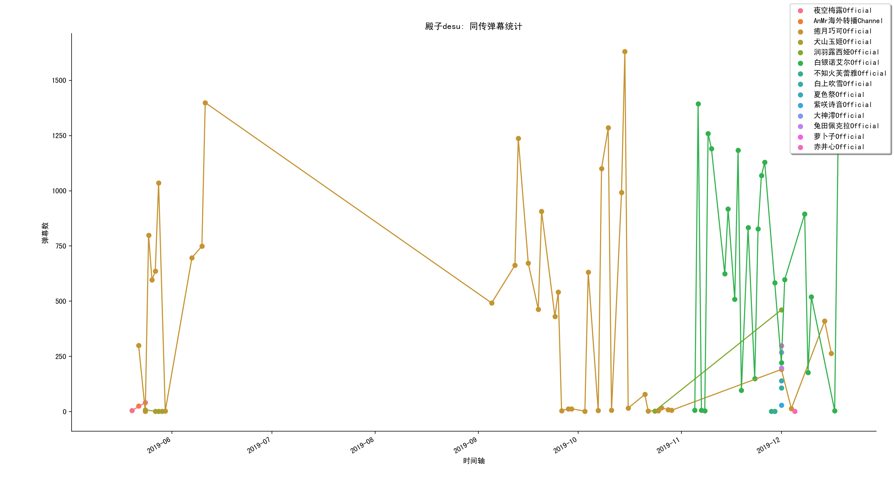
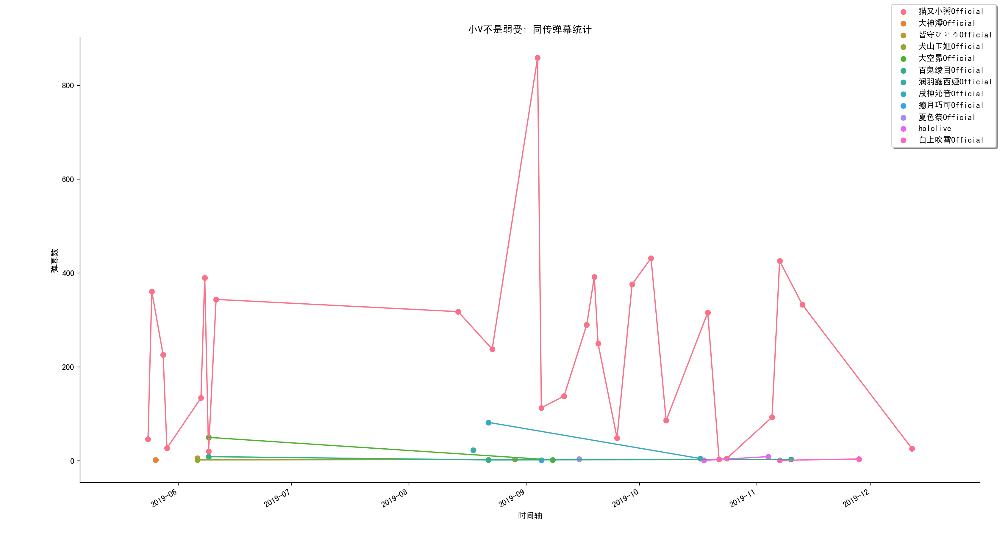
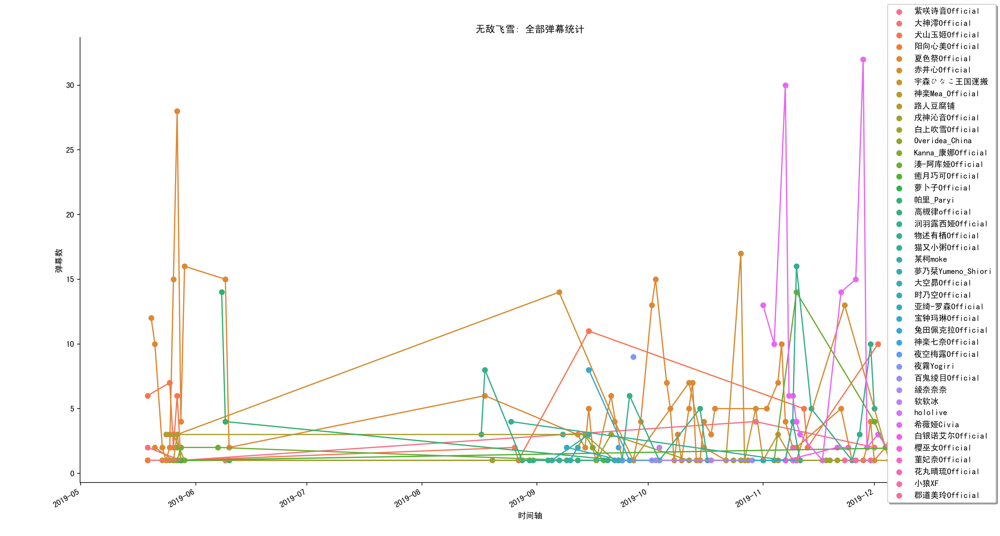

# DD_Radar-lock-on

<p>
    
</p>

### 📃 Introduction

同 传 摸 鱼/DD 检 测 机

本脚本通过对过去七个月所记录的vtuber相关bilibili直播弹幕处理，实现以下功能：

* 获取目标在vtuber相关直播间发送的弹幕
* 获取在vtuber相关直播间进行同传的名单
* 获取目标在vtuber相关直播间发送的弹幕数量变化
* 获取目标在vtuber相关直播间发送的同传弹幕数量变化
* 获取直播间同传man弹幕数变化情况

### 🌲 Request Packages

[](https://shields.io/)
[](https://shields.io/)
[](https://shields.io/)
[](https://shields.io/)
[](https://shields.io/)
[](https://shields.io/)
[](https://shields.io/)

### ⚡️ Quick start

首先，下载 [bilibili-vtuber-danmaku](https://github.com/dd-center/bilibili-vtuber-danmaku.git) 弹幕数据库:
```
git clone https://github.com/dd-center/bilibili-vtuber-danmaku.git
```

下载本repo:
```
git clone https://github.com/pren1/DD_Radar-lock-on.git
```

运行:
```python3
python3 Dataset_builder.py
```

然后，运行:
```python3
python3 Naive_data_insight.py
```

### 🎉 Result examples

同传man名单（含排名）将会被保存到 interpretation_man_rank.csv:

|     |                 |       | 
|-----|-----------------|-------| 
| Rank  | 昵称           | 同传弹幕数 | 
| 0   | 夜行游鬼            | 38644 | 
| 1   | 殿子desu          | 35289 | 
| 2   | 快递员小黑           | 23237 | 
| 3   | 精神王             | 18245 | 
| 4   | 叫霓裳             | 17710 | 
| 5   | HTdatou         | 12200 | 
| 6   | 天火official      | 11440 | 
| 7   | call_me_Gump    | 10078 | 
| 8   | 徽铯huise         | 9462  | 
| 9   | 長門凖             | 8898  | 
| 10  | 涼風青葉頑張るぞい       | 8143  | 
| 11  | 小V不是弱受          | 6500  | 
| 12  | scPointer       | 5012  | 
| 13  | namelostman     | 4594  | 
| 14  | 小天man           | 4590  | 
| 15  | LEDお兄ちゃん        | 4426  | 
| 16  | 樱晴末雨            | 4297  | 
| 17  | 校了个寂寞           | 4112  | 
| 18  | 有只小强爬过          | 3964  | 
| 19  | 夜语晚樱            | 3823  | 
| 20  | Diana-ディアナ      | 3356  | 
| 21  | 纯白Cco           | 3236  | 
| 22  | 斯辞              | 3226  | 

接下来是相关数据可视化:

#### 直播间同传弹幕数量变化
<p>
    
</p>

<p>
    
</p>

#### 同传man同传弹幕数量变化

<p>
    
</p>

<p>
    
</p>

#### 弹幕数量变化（包含同传与非同传）

<p>
    
</p>

### ☁️ Utilization

```python3
from Naive_data_insight import Naive_data_insight
NDI = Naive_data_insight()

# '导出同传man名单'
NDI.output_interpretation_man_rank_csv(csv_name="interpretation_man_rank.csv")

# ‘显示直播间同传弹幕数量变化’
NDI.visualize_single_room_timeline(room_id='13946381')

# ‘同传man同传弹幕数量变化 与 普通弹幕数量变化’
NDI.visualize_single_uid_timeline(input_UID='27212086')
```

```python3
from Dataset_searcher import Dataset_searcher
ds = Dataset_searcher("test.db")
ds.connect_dataset()

# '返回目标同传man发送的所有同传弹幕'
all_interpretation = ds.show_target_interpretation_from_UID(input_UID='13946381')

# ‘返回目标发送的所有弹幕’
all_danmaku = ds.show_all_danmaku_from_UID(input_UID='13946381')

# ‘返回目标同传弹幕信息随时间的变化’
single_uid_interpretation_timeline = ds.Single_UID_interpretation_timeline(input_UID='37718180')

# ‘返回目标弹幕数量随时间的变化’
single_uid_all_danmaku_timeline = ds.Single_UID_all_danmaku_timeline(input_UID='37718180')

# ‘设定最少发送的同传弹幕数，并以此筛选同传man名单’
simultaneous_interpretation_man_list = ds.select_simultaneous_interpretation_man(man_threshold=100, show_name=False)

# ‘获取某一时间段内的弹幕信息’
date_within = ds.select_date_within(start_date='2019-09-01', end_date='2019-09-30')

# ‘返回同传man的UID列表’
pure_uid_man_list = [row[0] for row in simultaneous_interpretation_man_list]

# ’返回目标直播间弹幕信息随时间的变化‘
single_live_roow_interpretation_timeline = ds.Single_live_room_interpretation_timeline(input_room_id='11588230', pure_uid_man_list=pure_uid_man_list)

# ‘生成直播间 ID与vtuber昵称的对应列表’
ds.build_fast_name_chart()

# ‘生成同传man UID与昵称的对应列表’
ds.build_simultaneous_interpretation_man_name_chart(pure_uid_man_list=pure_uid_man_list)
```
### ☀️ Special thanks
* 感谢所有【同传man】对bilibili vtuber直播所付出的努力
* 感谢[simon3000](https://github.com/simon300000)在开发过程中关于id与昵称转换的帮助
* 感谢[Curtis Xiao](https://github.com/wudifeixue)对开发提出的建议
